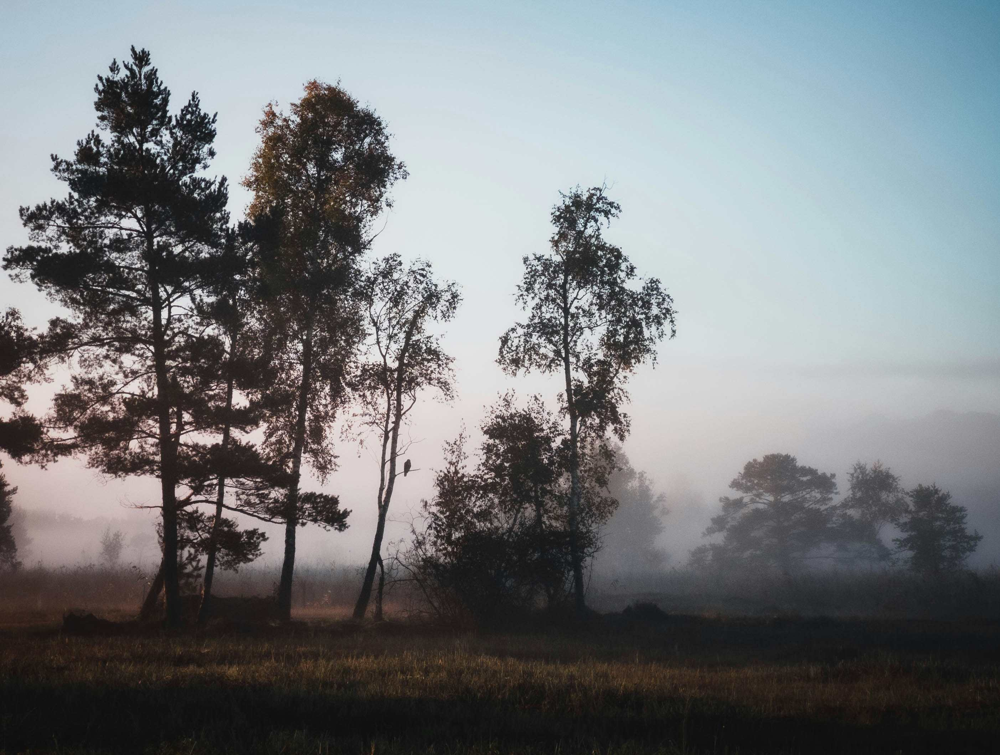

# Early in the morning

晨光初临，天地被一层轻柔的雾霭轻笼，如梦幻般的静谧悄然漫入每一寸空气。图片中，晨雾如幽灵般环绕着错落的树木，深色的树影在渐变的天幕下成为深情的注脚。光线轻柔得几乎要化作水，给松针与叶片镀上温柔轮廓，天空的色彩从暖粉缓缓过渡到浅蓝，晕染出朦胧而诗意的水彩画质地。近景草地的轮廓与中景树木的疏密错落，构成自然的构图韵律，远景雾霭中的树影若隐若现，如同古老传说正从岁月深处浮现。  

树木或挺拔雄健，或姿态婉约，在晨雾中形成富有层次的画面。深色的树影与朦胧雾气、淡色天光交织，构成静谧又充满生机的视觉韵律。雾气弥漫时，山谷间的空间被柔化，给自然赋予神秘而悠远的呼吸感，这是大地在晨光中清醒时轻缓的叹息。这片山林或许是一片原生态林域，晨雾是夜间降温使水汽凝结而成的独特地理景观，与当地的生活紧密相连。当地居民劳作时，晨雾、晨光与树木共同构成宁静的作业背景，古法劳作与自然气息交融，让森林四季的归音成为文化中关于平衡与共生的注脚。当晨雾在阳光中缓缓散去，森林迎来新生的光辉，而那片曾笼罩的雾霭，也成了自然与文化对话时的温柔媒介，记载着时光与土地的世代记忆。